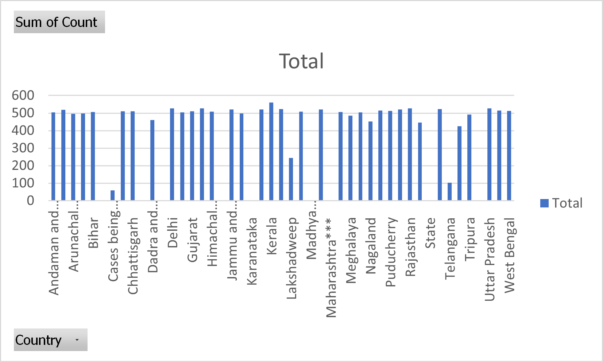

# map-reduce-tejaswi
practising mapping and  reducing

**Data set :**  

I have taken the dataset on Novel Corona Virus Disease 2019 in India. The following below is the link for the dataset 

[Covid-19](https://www.kaggle.com/sudalairajkumar/covid19-in-india?select=covid_19_india.csv)

**commands that I have used in powershell :**

cat covid_19_india.csv

cat covid_19_india.csv | python 02mapper.py

cat covid_19_india.csv | python 02mapper.py | sort

cat covid_19_india.csv | python 02mapper.py | sort  | python reduce2.py

cat covid_19_india.csv | Python 02mapper.py | sort | Python reduce2.py > AvulaOutput1.txt

cat covid_19_india.csv | Python 02mapper.py | sort | Python reduce2.py > AvulaOutput2.txt

**Data Story :**

Following below is the data story where I have sorted the Country and Count 
 

